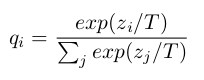
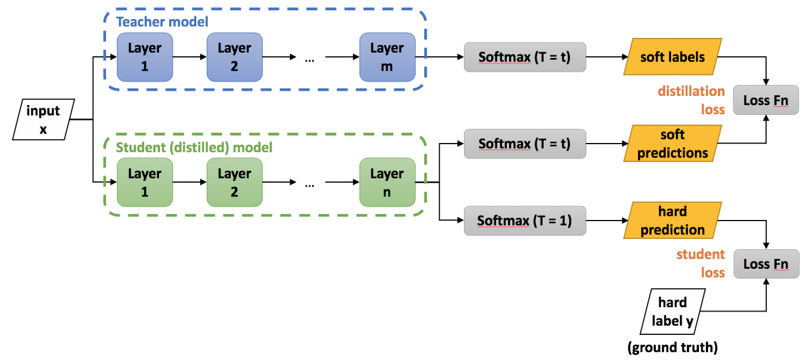
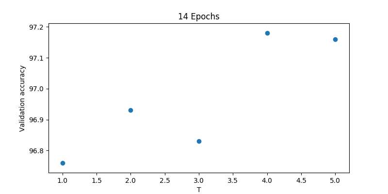
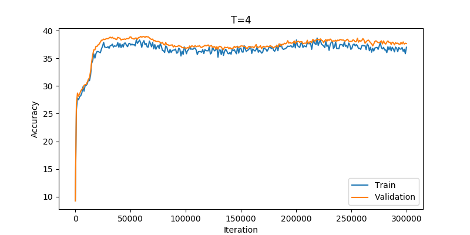

Deep Neural Networks have achieved high accuracy on many classification tasks. But as their name implies, these networks are deep, and thus, also big and computationally expensive. It is a big accomplishment to create a huge network that really nails it when you ask it to recognize a cat or a traffic sign. However, you want to use it on a mobile device or do real-time traffic sign classification to prevent an accident. Your network must also be small and fast.

A series of techniques have been developed to do this, like model compression. The one I will describe here is Knowledge Distillation, develop in 2015 by [Hinton et al](https://arxiv.org/abs/1503.02531).

## The idea behind distillation

The idea here is to "distill" the knowledge of a huge, fully trained neural network into a smaller one. This is done by a teacher - student process. On the student training, the teacher will make its own prediction to the data, and show it to the student net. The student learns not only from the labeled data, but also from the teacher high accurate predictions.

You will ask where is the advantage in this process. The teacher predictions are just the labels, if the accuracy is high indeed. Maybe we can also get predictions from unlabeled data, and so expand into a kind of unsupervised learning. However, the teacher has more insights about the data that it can teach the student.

I find the following a really cool idea. It takes advantage of some additional information that was always there, and most people just didn't realize they could use it.

A classification network usually outputs a list of probabilities for each class. The correct class will be the one with the highest probability, and that is the one we take. But the wrong classes have also probabilities assigned, and this is the additional information we can use.

See, when training a neural network we compare its results to the data labels. if represented in one-hot format, these are something like:

```[0, 0, 1, 0, 0, 0]```

In this case we want to discriminate between six different classes. In the example, the correct class is the third one, and the rest are of course wrong classes. It may be that we ask the network to classify a cat picture and its "cat class" is the class number 3.

But out big, teacher network will output something like:

```[0.1, 0.25, 0.45, 0.01, 0.04, 0.15]```

The network has it right, and the most probable class is class number 3. But we can also extract some information out of the probabilities of the wrong classes. We see, for example, that class 2 also has relatively high probability. Maybe this class bears some resemblance to cats. It may be the dog class. Meanwhile classes 4 and 5 are definitely not similar to our cat picture, and their probabilities are about equally low. Maybe they are classes very different to any animal and also similar to each other, like tennis balls for class 4 and golf balls for class 5.

The above is my human interpretation, of course. When our student network goes to training with the teacher output as its input, the backpropagation algorithm will modify the network weights in a way that not only maximizes class 3 (as it would do with the one-hot labels), but also really minimizes classes 4 and 5, and minimizes classes 1, 2, and 6 not so much.

## Distillation training

In their paper, [Hinton et al](https://arxiv.org/abs/1503.02531) use both the training data labels and the teacher net's predictions to train the student net. These predictions are called soft targets, in contrast to the hard targets of the labels.

The teacher net produces its soft targets using a "softmax" output layer. However, in a good accurate network the probabilities of the wrong classes are very small numbers. This small values will backpropagate to small weight deltas, and make the training less effective. To make the soft target more similar to my example above, we use the softmax with a higher temperature (T is usually 1):

<p align="center">

</p>

These soft target are compared with the student net's output to create a "distillation loss", that we will minimize on the training loop. This is added to the "student loss" that we use to train on the data at the same time. Using a weighted average of the two objective functions we are able to train even a small student net up to a similar accuracy to the big teacher network.

<p align="center">

</p>

## Code example

Next I want to take you through a very simple distillation example in PyTorch using MNIST. To practice yourself you can download the code from [GitHub](https://github.com/josehoras/Knowledge-Distillation) and play with this [Jupyter Notebook](https://github.com/josehoras/Knowledge-Distillation/blob/master/knowledge_distillation.ipynb).

To reduce all complexity and just focus on the distillation part I will train the student network using only the teachers' soft targets. This means we renounce the additional accuracy obtained by training with the original data labels. I also limit myself to use linear feedforward networks, without convolutions, batch normalization, etc... We'll just employ a big linear network and a small linear network.

We follow the next steps:
- Define and train a large network (teacher)
- Define and train a small network (student)
- Distillation training of the small network using only the teachers' soft targets

### Teacher Network

So, our teacher network is defined as:

```
class linear_net(nn.Module):
    def __init__(self, dropout=0.5):
        super(linear_net, self).__init__()
        self.linear_1 = nn.Linear(784, 1200)
        self.relu = nn.ReLU()
        self.dropout = nn.Dropout(p=dropout)
        self.linear_2 = nn.Linear(1200, 1200)
        self.relu = nn.ReLU()
        self.dropout = nn.Dropout(p=dropout)
        self.linear_3 = nn.Linear(1200, 10)
```

I just include the definition of ReLU twice to signal where it is called in the forward routine and achieve brevity. 

We train this network with a standard training loop in PyTorch. This will compare with the training we will use on distillation.

```
loss_fn = nn.CrossEntropyLoss()
optimizer = Adam(net.parameters(), lr=lr)
for features, labels in tqdm(train_loader):
	scores = net(features)
	loss = loss_fn(scores, labels)
	optimizer.zero_grad()
	loss.backward()
	optimizer.step()
```

A relatively long training over 20 epochs achieved the results:

```
Train accuracy: 99.66%
Validation accuracy: 98.18%
Test accuracy: 97.84%
```

### Student Network

For this one I chose the minimal two-layer network that can still be called neural net:

```
class small_linear_net(nn.Module):
    def __init__(self):
        super(small_linear_net, self).__init__()
        self.linear_1 = nn.Linear(784, 50)
        self.relu = nn.ReLU()
        self.linear_2 = nn.Linear(50, 10)
```
I also trained this network using the original MNIST data, just to check what is the typical behaviour. The results were:

```
Train accuracy: 99.27%
Validation accuracy: 96.92%
Test accuracy: 96.71%
```

As you see, the battle will come down to 1 or 1.25 percentage points difference on the test and validation sets respectively.

### Distillation training

Now our training loop looks somewhat different:

```
optimizer = Adam(small_model.parameters(), lr=lr)
for features, labels in train_loader:
	scores = small_model(features)
	targets = big_model(features)
	loss = my_loss(scores, targets, temperature = temp)
	optimizer.zero_grad()
	loss.backward()
	optimizer.step()
```

Although we keep the labels collection from the data loader, to keep the loop as it was, note that we do not use the labels in the training at all. We obtain the labels equivalent from the teacher model, and plug them into a custom loss function defined as:

```
softmax_op = nn.Softmax(dim=1)
mseloss_fn = nn.MSELoss()
def my_loss(scores, targets, temperature = 5):
    soft_pred = softmax_op(scores / temperature)
    soft_targets = softmax_op(targets / temperature)
    loss = mseloss_fn(soft_pred, soft_targets)
    return loss
```

And this actually works like a charm. A training over 14 epochs using T=4 delivered the results:

```
Train accuracy: 98.75%
Validation accuracy: 97.18%
Test accuracy: 97.01%
```

Note that we obtain slightly higher results on validation and test sets than training the student net on the train data, and the results are not that far of the teacher levels :)

According to the original paper temperatures from 2.5 to 4 are good for this small example. My own evaluation on this "temperature dependence" gave this result:

<p align="center">

</p>

## Playing around

In the original paper, Hinton et al. mention how their student net is able to extract the knowledge from the teacher, even when some examples are not present in the training data. They omitted all examples of the digit 3 on training, and despite this the distilled model was able to classify correctly most of the 3s in the test set. 

This makes sense if you consider that the net is not really realizing what a number is. It just replicates a mathematical function in the teacher net through backpropagation. That got me wondering what would happen in the extreme case where we just fed the networks random noise. The teacher net will still give a classification according to its inner mathematical function, and the student net will still try to replicate that function. So I slightly modified the code to:

```
for features, labels in tqdm(train_loader):
	rnd_features = torch.rand(100, 784).to(device)
	scores = small_model(rnd_features)
	targets = big_model(rnd_features)
	loss = my_loss(scores, targets, T= temp)
	optimizer.zero_grad()
	loss.backward()
	optimizer.step()
```

Still keeping the old loop, but disregarding all train data and feeding instead random noise. After playing with T and learning rate I got:

<p align="center">

</p>

Here the accuracy begins at 10%, which you would expect trying to guess a number from ten options. But then it rises quickly to close to 40%. I think this is remarkable. Just feeding random noise the student network figures out a function to achieve much more accuracy than purely random guesses. However, the accuracy stays there, despite me trying for a good while to obtain further improvement. But a different set of less wild random variations, like data augmentation, could probably deliver better results.

## Conclusion

We have seen how easy can it be to transfer the training from on big net to a small one using knowledge distillation. Once you have your big accurate network, this method has the advantage of not needing that much labeled data, and thus is easy and quick to implement.


